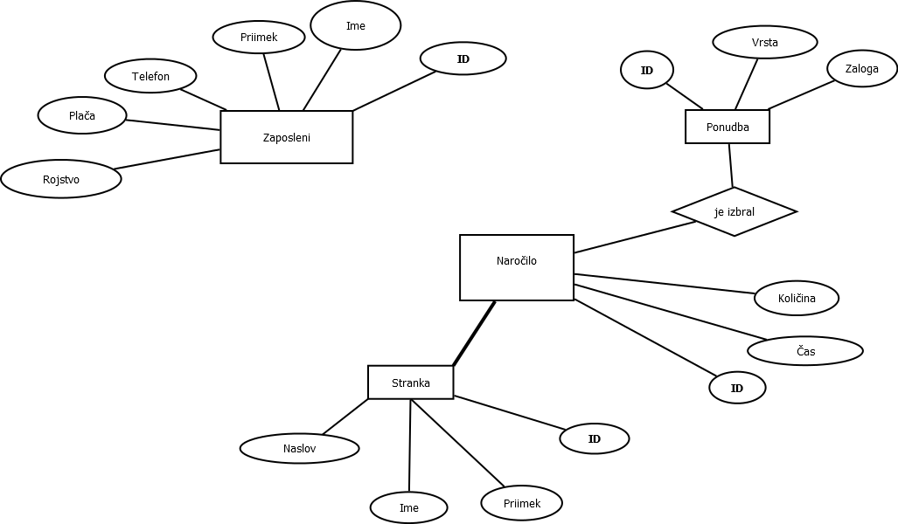

# Primer spletne aplikacije z `bottle.py`

*  Aplikacija `bottle.py`

# Restavracija Trio Adijo

## ER diagram

## Aplikacija
Aplikacija je sestavljena tako, da jo poženemo z restavracija.py.

Na začetku se nam odpre uvodna stran, na kateri lahko opazimo sliko restavracije in polja za prijavo ter registracijo. Po uspešni prijavi ali registraciji vstopimo v spletno aplikacijo kot uporabnik spletne restavracije, kjer lahko opazimo ponudbo, ki jo restavracija ponuja, in kjer lahko oddamo naročilo. Po uspešno oddanem naročilo, se izpiše znesek naročila, da vemo koliko bo potrebno plačati. Ustvarili pa smo tudi lastnika restavracije (uporabniško ime: nejcduscak, geslo: geslo), kateri ima možnost:
- spremeniti plačo svojim zaposlenim,
- dodajanja nove ponudbe v že obstoječo,
- zaposliti in zapisati v mapo novega zaposlenega
- povečati zalogo posamezne ponudbe.
S tem je naša aplikacija zaključena in omogoča prijetno izkušnjo naročanja hrane.

